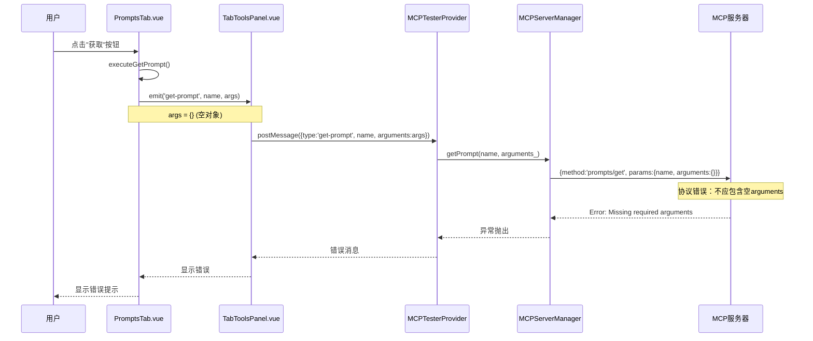

# MCP Tester 提示词参数错误修复设计文档

## 概览

本文档记录MCP Tester扩展中"获取提示词"功能的错误修复方案。当用户点击"获取"按钮获取不需要参数的提示词时，系统报错"MCP error 0: Missing required arguments"。

### 问题描述

- **问题现象**: 点击无参数提示词的"获取"按钮时报错
- **错误信息**: `获取提示词失败: MCP error 0: Missing required arguments`
- **影响范围**: 所有无参数或可选参数的提示词
- **发生版本**: 当前版本

### 根本原因

前端Vue组件向后端传递空参数对象`{}`，导致MCP SDK将其序列化为`arguments: {}`传递给MCP服务器。根据MCP协议规范，当提示词不需要参数时，请求中应完全省略`arguments`字段，而不是传递空对象。

## 技术架构

### 调用链路

整个提示词获取流程涉及四个层次的组件交互：



### 数据流转分析

| 层级 | 组件 | 数据格式 | 问题点 |
|------|------|---------|--------|
| 表现层 | PromptsTab.vue | `args: Record<string, string>` | 初始化为`{}`，即使无参数 |
| 通信层 | TabToolsPanel.vue | `{type:'get-prompt', name, arguments:args}` | 直接透传空对象 |
| 提供者层 | MCPTesterProvider | `data.arguments` | 未过滤空对象 |
| 服务层 | MCPServerManager | `{name, arguments: arguments_}` | ❌ 错误：将空对象发送给MCP |
| 协议层 | MCP服务器 | MCP协议请求 | 拒绝空arguments字段 |

## 修复方案设计

### 方案选择

考虑三种修复方案：

| 方案 | 修改位置 | 优点 | 缺点 | 选择 |
|------|---------|------|------|------|
| 前端过滤 | PromptsTab.vue | 问题源头解决 | 需修改多处前端代码 | ❌ |
| 通信层过滤 | TabToolsPanel.vue | 统一处理消息 | 中间层逻辑增加 | ❌ |
| 服务层过滤 | MCPServerManager | 符合单一职责原则，统一处理协议细节 | - | ✅ 推荐 |

**选择方案3的理由**：
- 服务层最接近协议实现，应负责协议规范的遵守
- 集中处理，避免前端多处修改
- 符合分层架构原则

### 核心修改逻辑

在`MCPServerManager.getPrompt()`方法中，根据参数对象状态决定是否包含`arguments`字段：

**修改前逻辑**：
```
无论参数是否为空，始终包含 arguments 字段
→ params: { name, arguments: arguments_ }
→ 导致空对象被发送到MCP服务器
```

**修改后逻辑**：
```
检查参数对象是否为空或无有效值
→ 如果为空：params: { name }
→ 如果有值：params: { name, arguments: arguments_ }
→ 符合MCP协议规范
```

判断条件：
- 参数对象不存在
- 参数对象为空对象（`Object.keys(arguments_).length === 0`）
- 所有参数值为undefined或空字符串

### 实现细节

修改文件：`src/server/mcp-server-manager.ts`

修改方法：`getPrompt(name: string, arguments_: Record<string, string> = {}): Promise<GetPromptResult>`

**修改位置**：第418-424行

**修改策略**：

1. 检查参数对象有效性
2. 构建动态params对象
3. 仅在有有效参数时包含arguments字段

**条件判断表**：

| 输入场景 | arguments_ 值 | 判断结果 | params输出 |
|---------|--------------|---------|-----------|
| 无参数提示词 | `{}` | 无效 | `{name}` |
| 空参数对象 | `undefined` | 无效 | `{name}` |
| 参数值全为空字符串 | `{arg1:'', arg2:''}` | 有效(保留) | `{name, arguments:{arg1:'',arg2:''}}` |
| 有有效参数 | `{arg1:'value'}` | 有效 | `{name, arguments:{arg1:'value'}}` |

### 代码修改设计

**原代码结构**：
```
方法签名：getPrompt(name, arguments_)
↓
构建请求对象：{ method, params: { name, arguments: arguments_ } }
↓
调用 _makeRequest()
```

**新代码结构**：
```
方法签名：getPrompt(name, arguments_)
↓
判断参数有效性
↓
有效？
├─ 是 → params = { name, arguments: arguments_ }
└─ 否 → params = { name }
↓
构建请求对象：{ method, params }
↓
调用 _makeRequest()
```

### 边界情况处理

| 场景 | 处理方式 | 预期结果 |
|------|---------|---------|
| 提示词定义了可选参数，用户未填写 | 发送`{name}`，省略arguments | ✅ 成功获取 |
| 提示词定义了必需参数，用户未填写 | 前端已有验证，不会发送请求 | ❌ 前端拦截 |
| 提示词无参数定义 | 发送`{name}`，省略arguments | ✅ 成功获取 |
| 提示词参数值包含空字符串 | 发送`{name, arguments:{...}}`，保留空字符串 | ✅ 服务器决定 |

## 验证测试策略

### 功能测试场景

**测试环境准备**：
- 连接到支持提示词功能的MCP服务器
- 准备包含不同参数配置的测试提示词

**测试用例设计**：

| 用例ID | 提示词类型 | 参数配置 | 用户操作 | 预期结果 |
|--------|-----------|---------|---------|---------|
| TC01 | 无参数提示词 | 无arguments定义 | 直接点击"获取" | ✅ 成功获取提示词内容 |
| TC02 | 可选参数提示词 | 1个可选参数 | 不填写参数，点击"获取" | ✅ 成功获取默认内容 |
| TC03 | 可选参数提示词 | 1个可选参数 | 填写参数值，点击"获取" | ✅ 成功获取带参数内容 |
| TC04 | 必需参数提示词 | 1个必需参数 | 不填写参数，尝试获取 | ❌ 前端提示"参数必需" |
| TC05 | 必需参数提示词 | 1个必需参数 | 填写参数值，点击"获取" | ✅ 成功获取内容 |
| TC06 | 混合参数提示词 | 必需+可选参数 | 仅填必需参数 | ✅ 成功获取内容 |

### 协议验证

**验证方法**：检查发送到MCP服务器的请求结构

**验证点**：

1. **无参数场景**：
   - 请求应为：`{method: "prompts/get", params: {name: "promptName"}}`
   - 不应包含`arguments`字段

2. **有参数场景**：
   - 请求应为：`{method: "prompts/get", params: {name: "promptName", arguments: {...}}}`
   - `arguments`对象应包含所有提供的参数

### 回归测试

**影响范围评估**：
- ✅ 工具调用功能：不受影响
- ✅ 资源读取功能：不受影响
- ✅ 其他提示词相关功能：验证正常

**测试方法**：
- 执行完整的功能回归测试套件
- 重点验证所有MCP协议请求的正确性

## 打包发布流程

### 构建步骤

**构建命令序列**：

1. 清理旧构建产物
2. 安装依赖（如需要）
3. 构建Vue WebView：`npm run build-webview`
4. 构建扩展：`npm run package`
5. 生成VSIX文件

**构建输出**：
- 产物位置：项目根目录
- 文件命名：`mcp-tester-{version}.vsix`

### 版本管理

**版本号策略**：
- 当前版本：从package.json读取
- 修复类型：Bug修复
- 版本递增：补丁版本号+1（如：1.0.0 → 1.0.1）

**变更记录**：
- 修复无参数提示词获取失败的问题
- 优化MCP协议请求参数处理

### 质量检查

**发布前检查清单**：

| 检查项 | 验证方法 | 状态 |
|--------|---------|------|
| 代码编译 | 无TypeScript错误 | ⬜ |
| Vue构建 | 无构建警告/错误 | ⬜ |
| VSIX生成 | 文件成功生成 | ⬜ |
| 功能测试 | 所有测试用例通过 | ⬜ |
| 扩展加载 | VSCode中成功激活 | ⬜ |
| 连接测试 | 成功连接MCP服务器 | ⬜ |
| 提示词功能 | 无参数提示词正常获取 | ⬜ |

### 安装验证

**验证步骤**：

1. 卸载旧版本扩展（如存在）
2. 安装新生成的VSIX文件
3. 重启VSCode
4. 打开MCP Tester
5. 连接到测试服务器
6. 执行完整功能测试

**验证结果记录**：
- 扩展版本号正确
- 所有功能正常工作
- 错误已修复且无新问题引入

## 风险评估与缓解

### 潜在风险

| 风险项 | 影响程度 | 概率 | 缓解措施 |
|--------|---------|------|---------|
| 修改破坏有参数提示词 | 高 | 低 | 充分测试所有参数场景 |
| MCP协议理解偏差 | 中 | 低 | 参考MCP官方文档验证 |
| 其他MCP请求受影响 | 低 | 极低 | 修改隔离在getPrompt方法 |
| 构建失败 | 低 | 低 | 使用稳定的构建命令 |

### 回滚方案

**回滚条件**：
- 测试发现严重功能缺陷
- 引入新的阻塞性问题

**回滚步骤**：
1. 保留修改前的代码版本（Git commit）
2. 如需回滚：`git revert <commit-hash>`
3. 重新构建和发布

## 实施检查表

- [ ] 阅读并理解问题根因
- [ ] 修改`mcp-server-manager.ts`中的`getPrompt`方法
- [ ] 本地编译验证无错误
- [ ] 连接MCP测试服务器
- [ ] 执行TC01-TC06所有测试用例
- [ ] 验证请求协议格式正确
- [ ] 执行回归测试
- [ ] 运行`npm run package`构建VSIX
- [ ] 安装VSIX文件到VSCode
- [ ] 最终用户验收测试
- [ ] 记录修复结果
